# **Challenge AluraONE ForoHub**

## **Descripción del Proyecto**
ForoHub es una API RESTful construida con **Spring Boot**, diseñada para gestionar un foro de discusión. Este proyecto fue desarrollado como parte del Challenge AluraONE y contiene las siguientes funcionalidades clave:
- Creación, listado, actualización y eliminación de **tópicos**.
- Creación, listado, actualización y eliminación de **respuestas**.
- Implementación de **JWT** para autenticación y autorización.
- Paginación y filtros para tópicos basados en **usuario**, **curso** o **palabras clave**.
- Seguridad configurada con **Spring Security**.
- Gestión de base de datos mediante **JPA** e **H2 Console**.

---

## **Características**

### **Endpoints Principales**
#### **Tópicos**
1. **Crear Tópico**
   - Endpoint: `POST /topicos`
   - Ejemplo:
     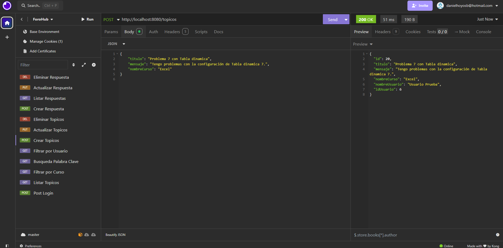

2. **Actualizar Tópico**
   - Endpoint: `PUT /topicos/{id}`
   - Ejemplo:
     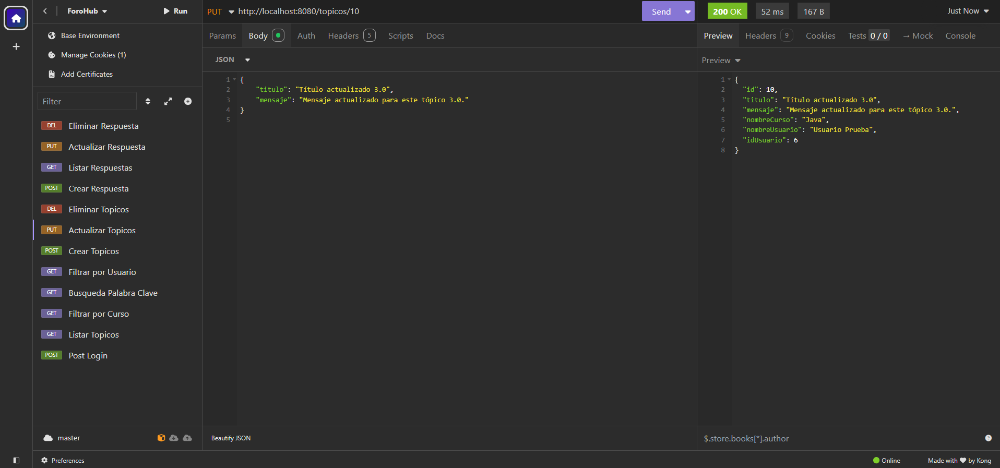

3. **Eliminar Tópico**
   - Endpoint: `DELETE /topicos/{id}`
   - Ejemplo:
     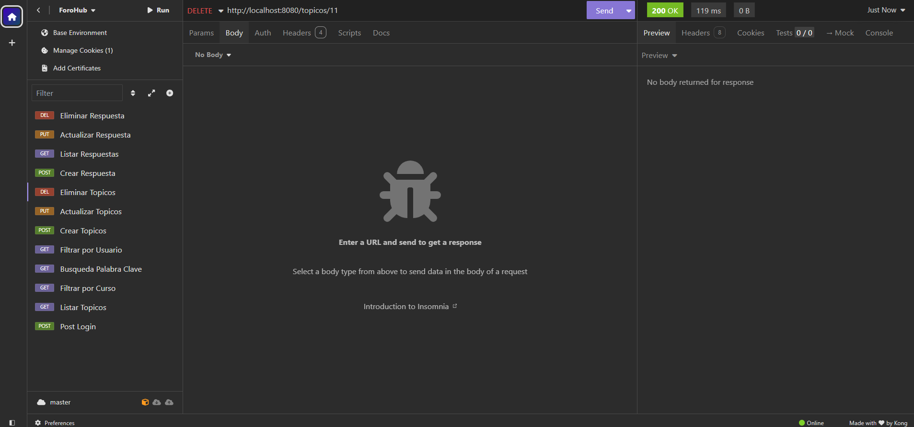

4. **Listar Tópicos con Paginación y Filtros**
   - Endpoint: `GET /topicos`
   - Ejemplo:
     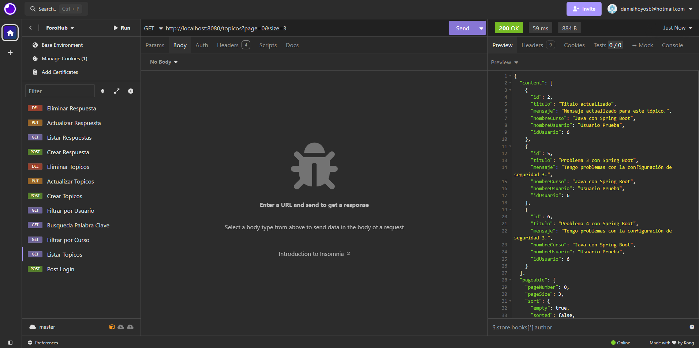

#### **Respuestas**
1. **Crear Respuesta**
   - Endpoint: `POST /respuestas`
   - Ejemplo:
     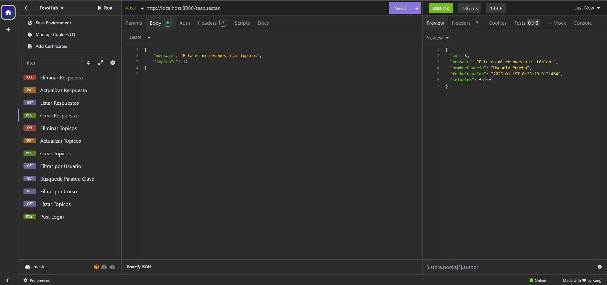

2. **Actualizar Respuesta**
   - Endpoint: `PUT /respuestas/{id}`
   - Ejemplo:
     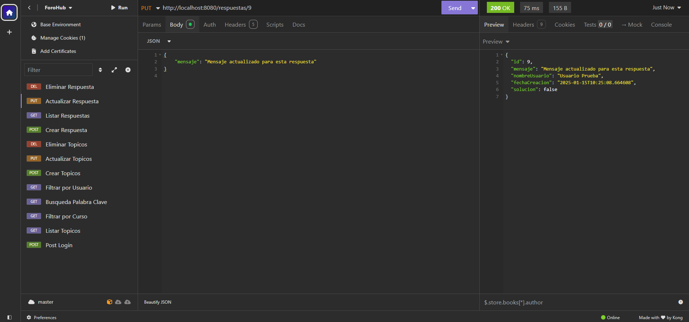

3. **Eliminar Respuesta**
   - Endpoint: `DELETE /respuestas/{id}`
   - Ejemplo:
     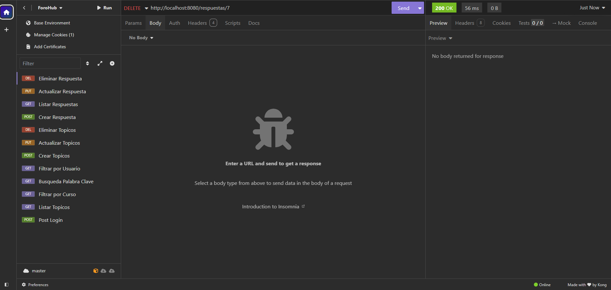

4. **Listar Respuestas**
   - Endpoint: `GET /respuestas`
   - Ejemplo:
     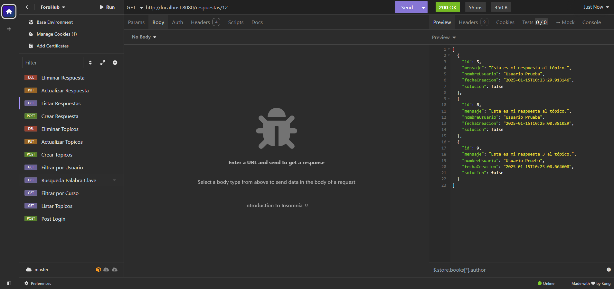

#### **Filtros**
1. **Filtrar por Usuario**
   - Endpoint: `GET /topicos/filtros?usuarioId={id}`
   - Ejemplo:
     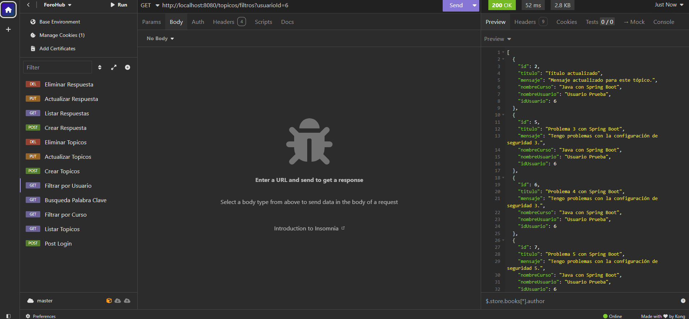

2. **Filtrar por Curso**
   - Endpoint: `GET /topicos/filtros?curso={nombre}`
   - Ejemplo:
     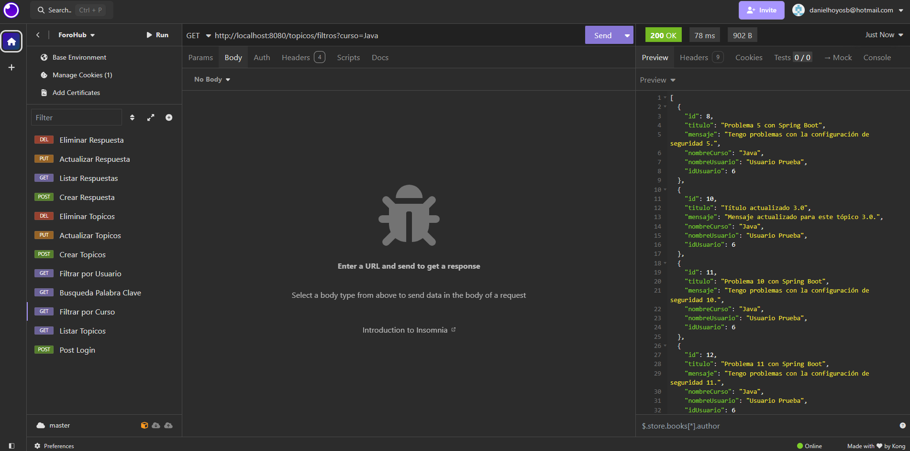

3. **Buscar por Palabra Clave**
   - Endpoint: `GET /topicos/filtros?keyword={palabra}`
   - Ejemplo:
     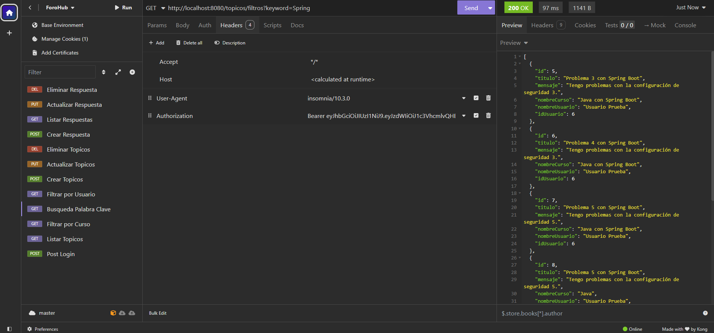

---

### **Autenticación y Autorización con JWT**
- **Login**
  - Endpoint: `POST /login`
  - Ejemplo:
    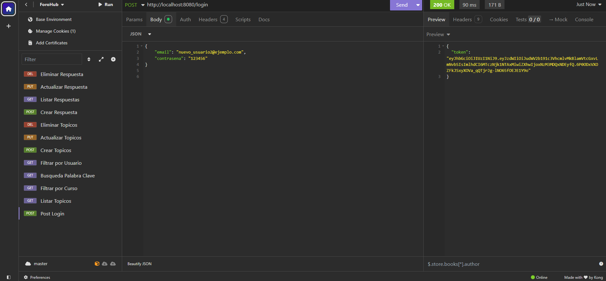

---

## **Instrucciones de Instalación**

### **Requisitos**
- **Java 17** o superior.
- **Maven**.
- Un IDE como IntelliJ o Eclipse.

### **Pasos**
1. Clona el repositorio:
   ```bash
   git clone https://github.com/danielho13/Challenge_AluraONE_ForoHub.git
